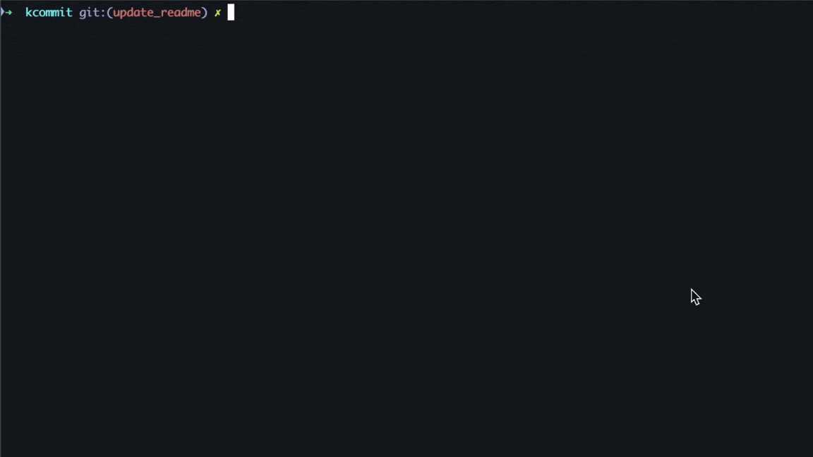

# kcommit
Git commit generator using Karma commit message style.


## 📝 Documentation

* [How it works](#how-it-works)
* [Install](#install)
* [Build from source](#build-it-from-source)
* [Custom config](#kcommit-custom-configs)


## ⚙️  How it works
kcommit simplifies creating commit messages by guiding you through the process. It automatically saves and reuses a `scope` for each project and branch, speeding up future commits.

Scopes are stored in `~/.kcommit/.kcommit_history.json`. kcommit manages this cache by removing unused branches after 1 month.

A typical commit message looks like:
`feat(cache-handling-remove-old-branches): create method to remove old branches`

The first segment is `the commit-type`. kcommit provides a default list of types, but you can define custom ones for each project [custom-config](#kcommit-custom-configs).
Finally, kcommit can either print the commit message or commit it for you.

First commit on a new branch:


New commit on the same branch with scope already saved on cache:


## 📦 Install
To install it via homebrew (MacOS and Linux)

```sh
brew tap BMilliet/tap
brew install bmilliet/tap/kcommit
```

## 🧰 Build from source

Install go on your machine.
Run:
```sh
make build
```
The command will create an executable named `kc`.
To use it you can add it to your `PATH`.


## kcommit custom configs
By default kcommit used the basic types from karma such as:

- feat: Adding a new feature.
- fix: Fixing a bug.
- refactor: Code change that does not change functionality or fix bugs.
- docs: Documentation update.
- style: Changes related to code style (spaces, missing semicolons, etc.) without affecting the logic.
- test: Adding or updating tests.
- chore: Updates that do not affect production code (build configuration, dependencies, etc.).

But it's possible to define your own types creating a file `.kcommitrc` at the root of your project following the format below:

```json
{
  "commitTypes": [
    {
      "type": "feat",
      "description": "Adds a new feature to the project."
    },
    {
      "type": "fix",
      "description": "Fixes a bug in the code."
    },
    {
      "type": "docs",
      "description": "Updates documentation only, without changing the code."
    },
    {
      "type": "style",
      "description": "Changes that do not affect functionality (e.g., formatting, whitespace)."
    },
    {
      "type": "refactor",
      "description": "Refactors code without changing existing functionality."
    },
    {
      "type": "test",
      "description": "Adds or updates automated tests."
    },
    {
      "type": "chore",
      "description": "Auxiliary tasks, such as dependency updates or configuration changes."
    },
    {
      "type": "perf",
      "description": "Performance improvements in the code."
    },
    {
      "type": "ci",
      "description": "Changes to the continuous integration configuration."
    },
    {
      "type": "build",
      "description": "Changes related to the build system or external dependencies."
    },
    {
      "type": "revert",
      "description": "Reverts a previous commit."
    }
  ]
}
```
